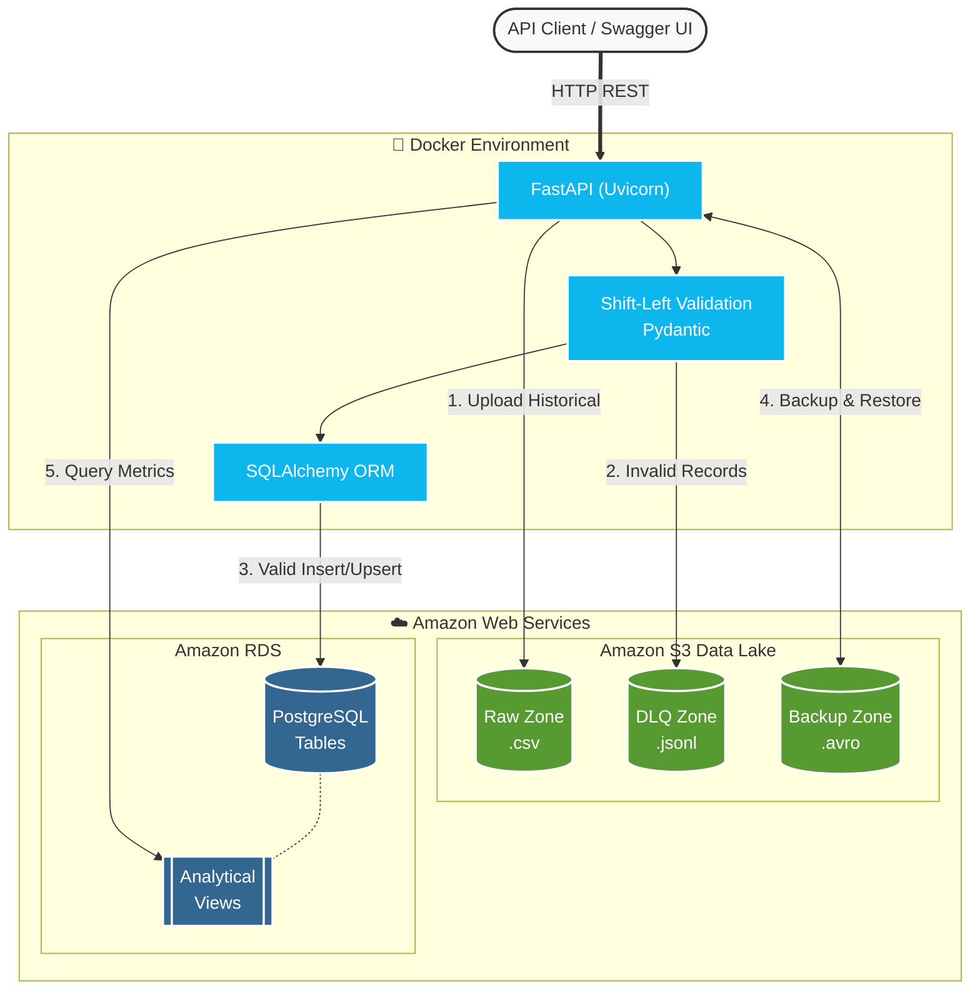

# 🚀 Data Engineering Challenge - Ingestion & Analytics Platform

A robust, stateless, and cloud-native REST API designed for the ingestion, validation, backup, and analysis of corporate Human Resources data.

## 🏗️ Project Architecture

This project implements **Clean Architecture** and **Shift-Left Data Validation** principles, ensuring that corrupted or malformed data is rejected and properly logged before it ever reaches the main database.

The platform utilizes a hybrid Transactional/Analytical approach:
* **Bronze Layer / Data Lake (Amazon S3):** Stores raw historical CSV files, manages the Dead Letter Queue (DLQ) logs, and persists binary backups (AVRO).
* **Silver / Gold Layer (PostgreSQL RDS):** Stores clean, validated data. Analytical metrics are delegated directly to the database engine via SQL Views to maximize performance and reduce memory overhead.

## 🛠️ Tech Stack

* **Language:** Python 3.13
* **API Framework:** FastAPI (Uvicorn)
* **Package Manager:** `uv` (Astral)
* **Database:** PostgreSQL (Amazon RDS)
* **ORM & Querying:** SQLAlchemy + Pydantic
* **Cloud Storage:** Amazon S3 (Boto3)
* **Data Formats:** JSON, CSV (Pandas), AVRO (FastAvro)
* **Infrastructure:** Docker (Non-root user, multi-stage optimized cache)

## ✨ Core Features

1. **Transactional Ingestion (Batch):** REST endpoints designed to insert anywhere from 1 to 1000 records per request efficiently.
2. **Historical Migration:** Uploads raw CSV files to S3 and performs massive batch processing into PostgreSQL.
3. **Dead Letter Queue (DLQ):** Records that fail structural (Pydantic) or relational (Foreign Keys) validation do not crash the application. Instead, they are routed to S3 as `.jsonl` files for future auditing.
4. **Disaster Recovery (Backup/Restore):** Administrative endpoints that serialize entire tables into AVRO format directly in-memory and stream them to S3. Restore operations utilize an `UPSERT` strategy to protect referential integrity.
5. **Analytical Metrics (OLAP):** Read-only endpoints that consume materialized views in the database to answer business questions instantly without overloading Python's memory.

---

## ⚙️ Prerequisites

* [Docker](https://www.docker.com/) installed on your machine.
* AWS Credentials (Access Key & Secret Key) with write permissions to an S3 bucket.
* A PostgreSQL database instance (Local or AWS RDS).

## 🚀 Setup & Local Deployment

###  Clone the repository
```bash
git clone [https://github.com/JuanJosephGG/de-challenge-gb.git](https://github.com/JuanJosephGG/de-challenge-gb.git)
cd de-challenge-gb
```

### Local Development (Without Docker)

If you prefer to run the application natively for active development or debugging, you can use `uv` as your package manager and environment resolver.

#### 1. Install Dependencies
Ensure you have `uv` installed, then synchronize the project dependencies:
```bash
uv sync --dev
```

#### 2. Configure Environment Variables
Ensure your .env file is present in the root directory.

Note: You must include your active local or cloud database credentials (e.g., PostgreSQL and AWS S3 keys) for the application to boot correctly. Do not commit this file to version control.

#### 3. Run the Development Server
Launch the FastAPI application with live-reload enabled:
```bash
uv run uvicorn main:app --reload --host 127.0.0.1 --port 8000
```

Note: > * The API will be available at: http://127.0.0.1:8000

The interactive Swagger documentation will be accessible at: http://127.0.0.1:8000/docs


---

## 📁 Project Structure
```bash
de-challenge-gb/
├── src/
│   ├── api/                   # FastAPI routers and controllers
│   ├── config/                # Environment configurations (Pydantic BaseSettings)
│   ├── connections/           # S3 and Database clients (SQLAlchemy)
│   ├── domain/                # ORM Models and Pydantic Schemas
│   └── use_cases/             # Core business logic (Ingestion, DLQ, Backup)
├── .dockerignore
├── .gitignore
├── Dockerfile                 # Multi-Stage optimized image
├── pyproject.toml             # Dependencies manager (uv)
└── README.md
```

---

## 📁 Project Architecture


---

## 📁 Docker deployment
```bash
# Build the Docker image
docker build -t data-platform-api:latest .

# Run the container in the background, injecting the environment variables
docker run -d \
  --name my-data-api \
  -p 8000:8000 \
  --env-file .env \
  data-platform-api:latest

# Tail the logs to confirm successful startup
docker logs -f my-data-api
```